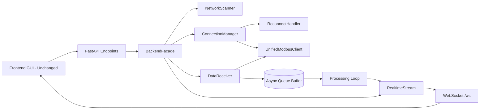
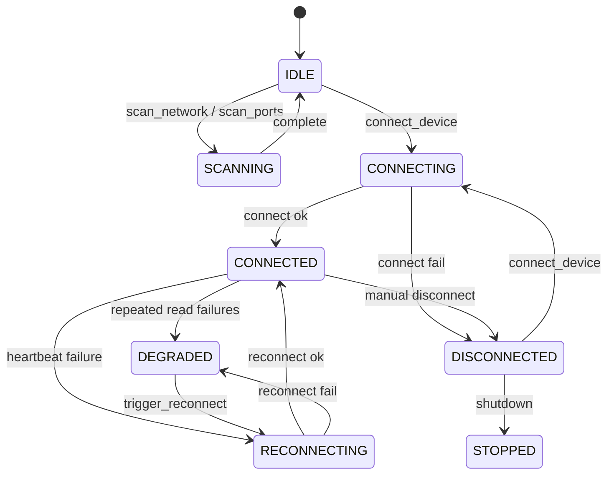
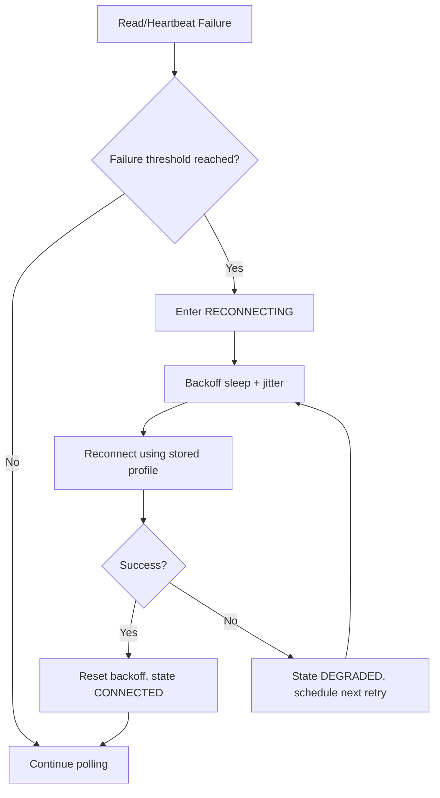
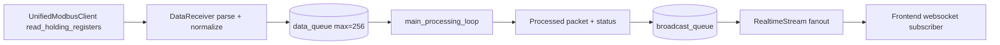

# DXM Backend Redesign (Frontend Unchanged)

## Scope
This redesign changes only backend networking, connection lifecycle, and real-time pipeline behavior.
No frontend UI layout, controls, routes, or view flow were changed.

## Module Structure
- `core/network_discovery.py`
  - Async subnet scan (`/24`) with bounded concurrency, timeout, retry
  - Async serial port scan
- `core/modbus_client.py`
  - Unified Modbus transport abstraction (TCP + RTU)
  - Heartbeat probe and guarded read operations
- `core/reconnect_handler.py`
  - Exponential backoff with jitter
- `core/connection_manager.py`
  - Connection state machine
  - Watchdog heartbeat and failover-driven reconnect
  - Frontend-compatible connection status contract
- `core/data_receiver.py`
  - Queue-buffered polling worker
  - <500 ms target cycle (`poll_interval=0.25`)
  - Packet-loss accounting and reconnect trigger
- `core/realtime_data_stream.py`
  - Non-blocking websocket broadcaster with latest-packet cache
- `core/backend_facade.py`
  - High-level backend API (`scan_network`, `scan_ports`, `connect_device`, `get_live_data`)

## Backend Architecture Diagram


## Threading / Async Model
- Single async event loop (FastAPI/uvicorn)
- Long-running background tasks:
  - `ConnectionManager._watchdog_loop()` heartbeat task
  - `DataReceiver._poll_loop()` polling task
  - `RealtimeStream._broadcast_loop()` websocket fanout task
- All network I/O is async and non-blocking
- Serial port listing is offloaded via `asyncio.to_thread`
- Queue decouples acquisition and broadcast to avoid UI stalls

## Connection State Machine


## Reconnection Flow


## Data Pipeline Flow


## Frontend-Compatible High-Level API
Exposed through backend internals and used by API routes:
- `scan_network(subnet)`
- `scan_ports()`
- `connect_device(protocol, ...)`
- `disconnect_device()`
- `get_status()`
- `get_live_data(timeout)`

## Example Skeleton Backend Usage
```python
connection_manager = ConnectionManager()
data_receiver = DataReceiver(connection_manager, poll_interval=0.25)
realtime_stream = RealtimeStream()
backend = BackendFacade(connection_manager, data_receiver, realtime_stream)

await backend.start()

devices = await backend.scan_network("192.168.1")
ports = await backend.scan_ports()

ok = await backend.connect_device(protocol="TCP", host="192.168.1.44", slave_id=1)
if ok:
    status = backend.get_status()
    packet = await backend.get_live_data(timeout=1.0)

await backend.stop()
```

## Industrial-Grade Safeguards Included
- No blocking socket calls in request path
- Heartbeat watchdog with reconnect on liveness loss
- Exponential backoff + jitter (prevents retry storms)
- Queue backpressure with oldest-drop policy
- Safe task cancellation/shutdown
- Structured status telemetry (`state`, `packet_loss`, reconnect info)
- Protocol abstraction (TCP/RTU) hidden from frontend
- Path ready for multi-DXM scaling via additional connection profiles
